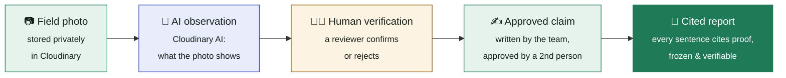
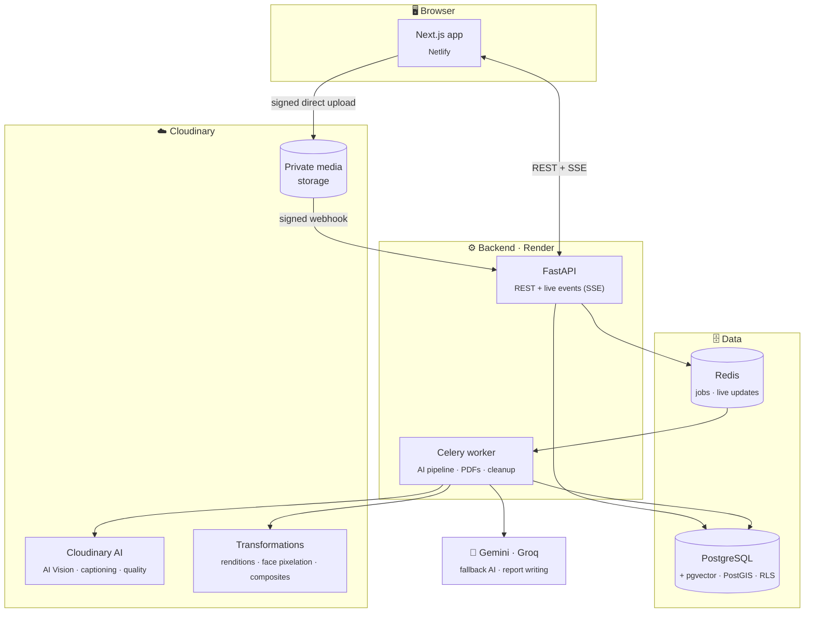
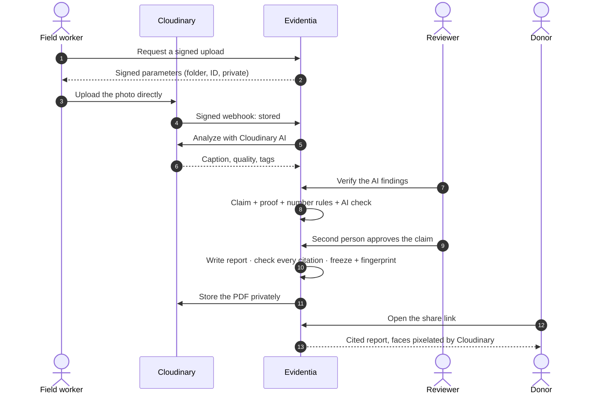

<div align="center">

# Evidentia

### Turn field photos into evidence you can trust.

**Every sentence and every pixel traces back to its source.**

[](https://evidentiia.netlify.app)
&nbsp;
[](https://cloudinary.com)


*Built for PS02 · AI-Powered Impact & Sustainability Media Platform (Cloudinary track)*

</div>

---

## 💡 The problem

NGOs and city departments photograph their field work every day: cleaning drains, building water
tanks, planting trees. But when a donor asks *"prove it"*, the photos are lost in WhatsApp groups, and
the report simply says **"4 drains cleared"**, with nothing behind it.

Reports are just words. And with AI writing them, it's easier than ever to produce text that *sounds*
right but isn't backed by anything.

## ✅ The solution: a chain of trust

Evidentia connects every sentence of a report to real, verified evidence.



> **Think of an expense claim:** the sentence is the *claim*, the photo is the *receipt*.
> No receipt, no approval.

| Term | Meaning | Example |
|---|---|---|
| **Observation** | What a photo shows, found by AI and confirmed by a person | *"Manhole open", 95%* |
| **Claim** | A statement for the report, backed by verified photos | *"Street 15 was cleaned by sanitation workers"* |
| **Metric** | A counted number with a declared source | *"4 drains, from job sheets"* |

---

## ✨ Features

| | Feature | What it does |
|---|---|---|
| ▶️ | **Demo mode** | The whole flow on one page: upload → search → one-click claim → one-click report |
| ☁️ | **Private uploads** | Photos go straight from the browser to Cloudinary, signed by the server |
| 🤖 | **AI understanding** | Captions, quality, and tags from each project's own activity list |
| 🔎 | **Plain-English search** | *"person inside a drain without protective gear"*, with *why* each result matched |
| 🧑‍⚖️ | **Review queue** | Humans approve or reject every AI finding |
| ✍️ | **Guided claims** | Add proof → AI check → submit → approval by a second person |
| 📄 | **Cited reports** | Claim cards, automatic timeline, evidence gallery, limitations, appendix, PDF |
| 🔒 | **Tamper check** | Published reports are frozen; *Verify* proves nothing has changed |
| 🖼️ | **Before / after** | Finds photos of the same place over time, aligns them, measures visible change |
| 📣 | **Campaign Studio** | Social images (1:1, 4:5, 9:16, 16:9) with faces automatically pixelated |
| 🔗 | **Share links** | Read-only, expiring, privacy-redacted report links for donors, with PDF download |
| 🗺️ | **Map, timeline & analytics** | Geotagged evidence, AI usage and latency |

## 🛡️ Why you can trust it

- **The AI can't invent facts or numbers.** A rule-based checker (not AI) deletes any sentence without
  a citation, and any number that doesn't match a sourced metric.
- **Four-eyes rule.** The person who writes a claim can never approve it.
- **Tamper-proof reports.** Publishing freezes the report and fingerprints it (SHA-256). A database
  trigger blocks edits; *Verify* rebuilds the report and compares.
- **Honest by design.** Limitations are written by rules, not AI, and bad news stays visible (e.g. a worker entering a drain without protective gear).
- **Privacy first.** Evidence is private; anything shared outside is face-pixelated by Cloudinary.
- **Tenant isolation.** PostgreSQL row-level security keeps each organisation's data separate.

---

## ☁️ How Cloudinary powers Evidentia

Cloudinary is the backbone of the platform, not an add-on.

| Need | Cloudinary feature |
|---|---|
| Private, tamper-proof ingestion | Signed `authenticated` uploads, signed upload presets, verified webhooks |
| Understand every photo | **Analyze API / AI Vision**: `captioning`, `image_quality`, `ai_vision_general`, `ai_vision_tagging` with project-specific tags |
| Traceable images | **Named transformations** in strict mode; every recipe is recorded in the report |
| Privacy | Signed and expiring delivery URLs, `e_pixelate_faces` on everything shared publicly |
| Video evidence | `so_`/`eo_` clips, `sp_auto` adaptive streaming, Cloudinary Video Player |
| Visual storytelling | Overlays (`l_`, `fl_layer_apply`) for before/after composites, `g_auto` smart crops for social formats |
| Reports | Final PDFs stored as private raw assets, shared through expiring links |
| Search and sync | Cloudinary Search API as a retriever, and verified results written back as tags and context |

---

## 🏗️ Architecture



### From upload to report



---

## 🚀 Try it

1. Open **[evidentiia.netlify.app](https://evidentiia.netlify.app)**. The free server may take about 30 s to wake up.
2. Click **Start demo** (no password needed) and pick a project.
3. **Upload** a field photo, then **Search** for it in plain English.
4. Click **Make claim**, then **Generate & publish report**.
5. Open the report, click a citation, then **Verify** and **Download PDF**.

Want the full team workflow? Sign in as **Ravi** (uploads), **Meera** (reviews) and **Asha** (approves and publishes) instead.

---

## 🧰 Tech stack

| Layer | Technology |
|---|---|
| Frontend | Next.js · React · TypeScript · Tailwind CSS · TanStack Query |
| Backend | Python · FastAPI · SQLAlchemy · Alembic · Pydantic |
| Background jobs | Celery · Redis |
| Database | PostgreSQL · pgvector (AI search) · PostGIS (maps) · row-level security |
| Media and AI | **Cloudinary** (storage, AI, transformations) · Gemini · Groq · SigLIP · OpenCV |
| Reports | Jinja2 · Playwright (headless Chrome) → PDF |
| Deployment | Netlify (web) · Render (API + worker + Postgres) · cloud Redis |

## 🖥️ Run locally

**Requires:** macOS or Linux, Python 3.12+, [uv](https://docs.astral.sh/uv/), Node 20+ and pnpm. No Docker.

```bash
git clone https://github.com/Abuzaid-01/Evidentia.git && cd Evidentia
make setup                      # Postgres (+pgvector, PostGIS), Redis, dependencies, migrations
# add CLOUDINARY_URL, GEMINI_API_KEY, GROQ_API_KEY to .env
make cloudinary-bootstrap       # create upload presets + named transformations
make dev                        # API :8000 · worker · web :3000
```

Open **http://localhost:3000** and click **Start demo**.
In Cloudinary, register the free **AI Vision**, **AI Content Analysis**, **Google Auto Tagging** and **OCR** add-ons.

## 📁 Project structure

```
apps/web/                 Next.js frontend
services/api/             FastAPI: routes, auth, business logic
services/worker/          Celery: AI pipeline, PDFs, Cloudinary sync
packages/core/            Domain rules, database models, settings
packages/cloudinary_kit/  Everything Cloudinary: signing, webhooks, delivery, AI, transformations
packages/ai/              AI providers, claim validator, report writer
packages/ml/              Embeddings (SigLIP), before/after alignment
packages/reporting/       Report HTML templates and PDF rendering
migrations/               Database schema and row-level security
```

## 🧪 Quality

```bash
make check      # lint + type checks + 179 automated tests
make loadtest   # measured search benchmark on 1,000 assets
```

Tests run against a real PostgreSQL and Redis, and cover tenant isolation, webhook security, claim
rules, report immutability and verification, privacy-redacted sharing, and project deletion.
Search on 1,000 assets: **p95 554 ms** with 10 concurrent users.

## 🗺️ Roadmap

- Real sign-in (Clerk) instead of demo personas
- Error monitoring (Sentry) and tracing (OpenTelemetry)
- Evaluation on real, labelled field data
- An offline-capable mobile app for field workers
- Multilingual search and reports

## 📚 More

- [Developer guide](docs/DEVELOPMENT.md): full API reference, configuration and internals
- [Deployment guide](docs/DEPLOYMENT.md)

---

<div align="center">

**Evidentia** · Built on Cloudinary · *Every sentence and every pixel traces back to its source.*

</div>
